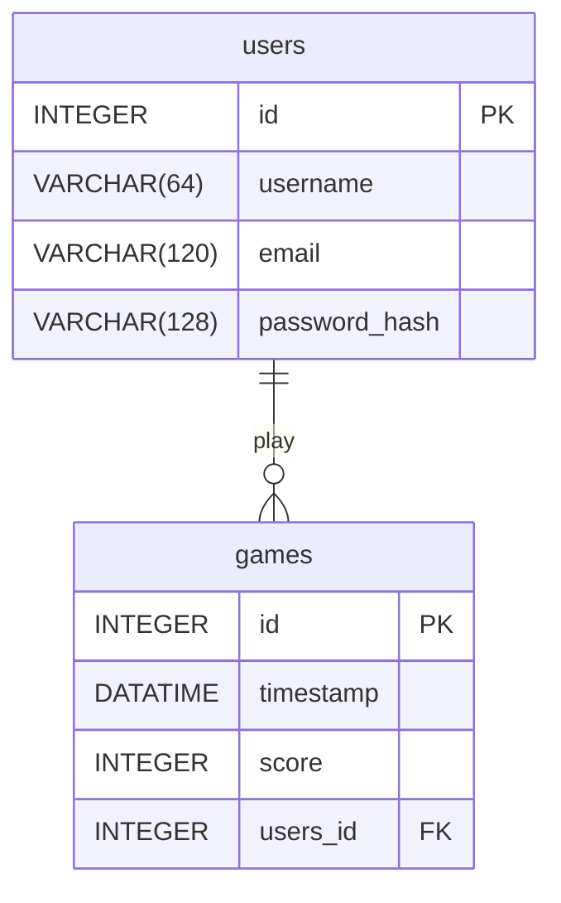

```mermaid
erDiagram
    users ||--o{ games : play
    users {
        INTEGER id PK
        VARCHAR(64) username
        VARCHAR(120) email
        VARCHAR(128) password_hash
        %% relation attribute games define in User class %%
        %% i am a comments %%
    }
    games {
        INTEGER id PK
        DATATIME timestamp
        INTEGER score
        INTEGER users_id FK
        %%  relation attribute: player %%
    }
```