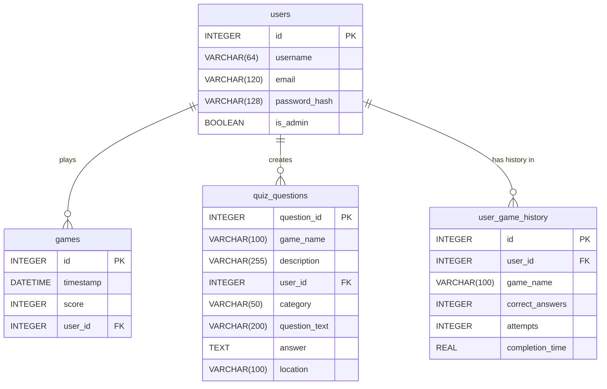

```mermaid
erDiagram
    users ||--o{ games : "plays"
    users {
        INTEGER id PK
        VARCHAR(64) username
        VARCHAR(120) email
        VARCHAR(128) password_hash
        BOOLEAN is_admin
    }
    games {
        INTEGER id PK
        DATETIME timestamp
        INTEGER score
        INTEGER user_id FK
    }

    users ||--o{ quiz_questions : "creates"
    quiz_questions {
        INTEGER question_id PK
        VARCHAR(100) game_name
        VARCHAR(255) description
        INTEGER user_id FK
        VARCHAR(50) category
        VARCHAR(200) question_text
        TEXT answer
        VARCHAR(100) location
    }

    users ||--o{ user_game_history : "has history in"
    user_game_history {
        INTEGER id PK
        INTEGER user_id FK
        VARCHAR(100) game_name
        INTEGER correct_answers
        INTEGER attempts
        REAL completion_time
    }

```